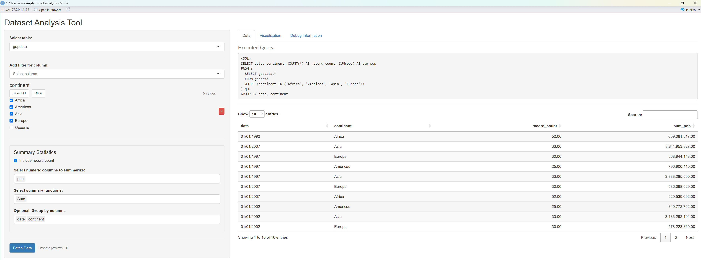
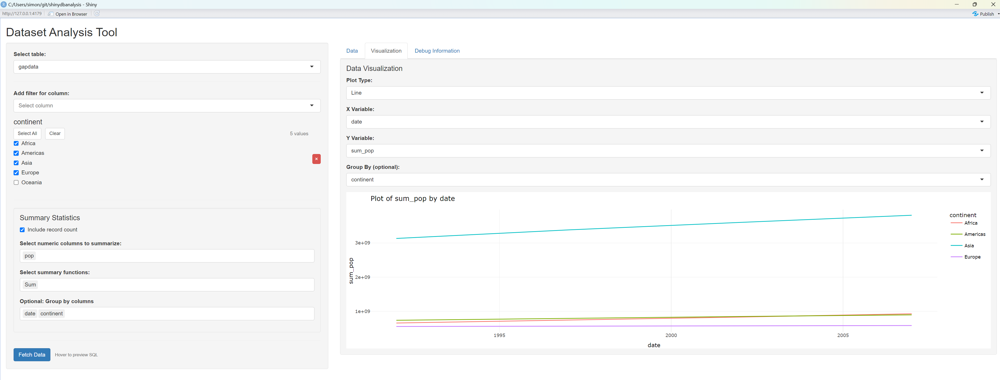
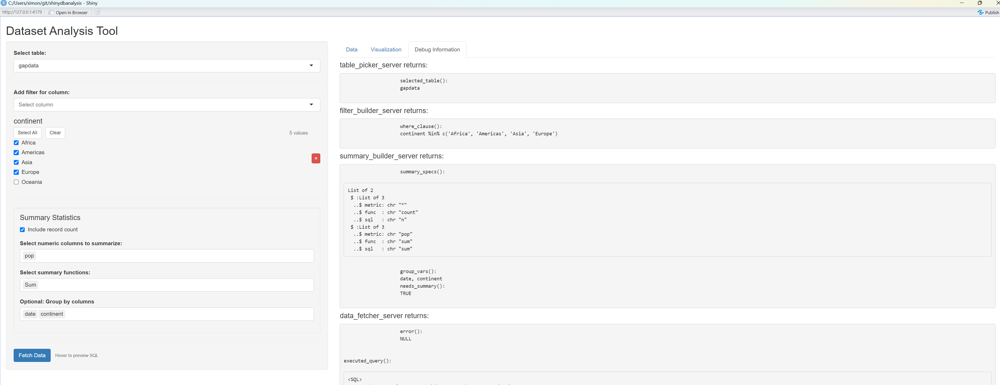
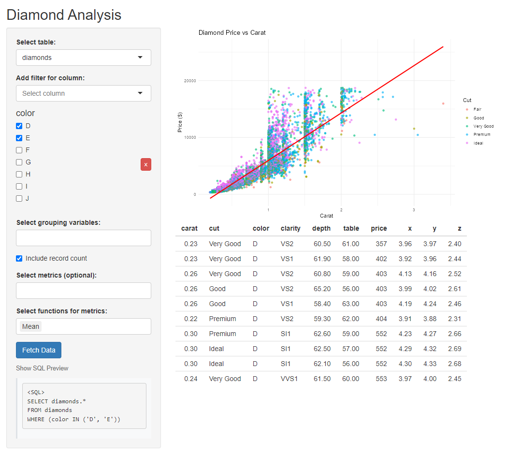

<!-- README.md is generated from README.Rmd. Please edit that file -->

```{r, include = FALSE}
knitr::opts_chunk$set(
  collapse = TRUE,
  comment = "#>",
  fig.path = "man/figures/README-",
  out.width = "100%"
)
```

# shinydbanalysis

A database-agnostic Shiny package for interactive data analysis with filtering, grouping, and summarization capabilities. Works with any database supported by dbplyr.

The goal is to allow the user to easily interact with tables that are lazy-loaded in a SQL database.     
Lazy loading is great as it saves on RAM and all the computations happen on the SQL server.  
I wanted the user to be able to easily pick filters like in the {shinyDataFilter} package, which sadly doesnt support databases at the moment.  
I found that querying the databases "on the fly" to get the column names or the distinct values of each columns takes a while and makes my apps unenjoyable to use. The idea I came up with is to get ALL the distinct values in a script in a script that lives in a cronjob, then have the shiny app simply load these  distinct values (and column data types) at startup.  

The {shinydbanalysis} offer the following modules you can use in your own apps:   

* table_picker_server() , allows the user to pick the table they want to use.  The table must exist in the pool and also have had `create_column_info("tablename", pool, "column_info")` run to create it's metadata file.  
* filter_builder_server()  allows the user to create the filters they want.   
* summary_builder_server() allows the user to select the summary functions they want to use  (count, max, min ,mean) and on which (numeric) variables they want to apply them  
* data_fetcher_server() creates a sql query from all of the above and returns the fetched table.   
* plot_builder_server() allows the user to create a plot from the fetched data.  

## Installation


```{r, eval= FALSE}
# install.packages("devtools")
devtools::install_github("SimonCoulombe/shinydbanalysis")
```

# Quick Start: Built-in Demo Apps with Pre-Packaged Data

The package includes a pre-packaged DuckDB database (`demo.duckdb`) with three tables (diamonds, iris, gapdata) and their pre-computed column metadata. This means you can start exploring immediately **with zero setup**!

## Instant Demo Apps

Launch a full-featured demo app with **no configuration required**:

```{r, eval = FALSE}
library(shinydbanalysis)
library(bslib)
# Full demo app with all features
demo_shinydbanalysis_app(pool = get_demo_pool(), storage_info = get_demo_storage_info())

# OR use the simplified all-in-one module version
demo_shinydbanalysis_app_all_in_one_module(pool = get_demo_pool(), storage_info = get_demo_storage_info())
```

That's it! The apps will automatically:

* Connect to the pre-packaged `demo.duckdb` database (located in `inst/extdata/`)
* Load pre-computed column metadata from `inst/extdata/column_info/`
* Give you access to three tables: **diamonds**, **iris**, and **gapdata**

Screenshot of the app after fetching some data:  


Screenshot of the app after fetching some data and creating a data vizualisation:    


Screenshot of the app in the "debug information" tab:  



## Individual Module Demos

You can also try out individual modules to understand each component:

```{r, eval = FALSE}
# Demo individual modules
single_filter_demo()      # Single column filter with different types
filter_builder_demo()     # Multiple filters working together
group_builder_demo()      # Grouping with banding and regrouping
summary_builder_demo()    # Summary statistics configuration
```

These smaller demos help you understand how each module works before building your own custom app.

---

# Creating Your Own Database and Column Info

To use the package with your own database, you need to:

1. **Create a database connection pool**
2. **Generate column metadata** using `create_column_info()`

## Example: Setting Up Your Own Data

```{r, eval = FALSE}
library(shinydbanalysis)
library(duckdb)
library(pool)
library(ggplot2)
library(dplyr)

# Create a DuckDB connection pool
pool <- dbPool(
  drv = duckdb::duckdb(),
  dbdir = ":memory:"  # or path to a file: "my_database.duckdb"
)

# Load your datasets
dbWriteTable(pool, "diamonds", ggplot2::diamonds)
dbWriteTable(pool, "iris", iris)

# Create directory for column metadata
dir.create("column_info", showWarnings = FALSE)

# Generate column information for each table
# This pre-computes column types, distinct values, etc.
create_column_info("diamonds", pool, 
                   storage_type = "local",
                   column_info_dir = "column_info")

create_column_info("iris", pool,
                   storage_type = "local", 
                   column_info_dir = "column_info")


# Create storage info configuration
storage_info <- list(
  storage_type = "local",
  column_info_dir = "column_info",
  adls_endpoint = NULL,
  adls_container = NULL,
  sas_token = NULL
)


# Now launch the app with your data
demo_shinydbanalysis_app(
  pool = pool,
  storage_info  = storage_info
)
```

## Using ADLS (Azure Data Lake Storage) for Column Info

If hosting your app on Posit Connect or other cloud platforms, you can store column info in Azure Data Lake Storage:  

```{r,eval = FALSE}
# Create column info and store in ADLS
shinydbanalysis::create_column_info(
  tablename = "myschema.iris", 
  pool = pool,
  storage_type = "adls",
  column_info_dir = "column_info",
  adls_endpoint = "https://myadlsenpoint.blob.core.windows.net/", 
  adls_container = Sys.getenv("adls_container"),
  sas_token = Sys.getenv("sas_token_dev"))


# Create storage info configuration
storage_info <- list(
  storage_type = "adls",
  column_info_dir = "column_info",
  adls_endpoint = "https://myadlsenpoint.blob.core.windows.net/", 
  adls_container = Sys.getenv("adls_container"),
  sas_token = Sys.getenv("sas_token_dev"))
)


# Launch demo app with ADLS storage
demo_shinydbanalysis_app(
  pool = pool,
  storage_info = storage_info
)
  
```


## column_info metadata 

Here is an example of the content of the column_info parquet files :

```{r}

metadata_df <- read_column_info(
  tablename = "gapdata",
  storage_type = "local",
  column_info_dir = "column_info"
)
metadata_df
```

## Restricting columns   

You may want to restrict the users from accessing certain columns without modifying the whole base..  You can use the "restricted_columns" parameter.  Here we will remove 'continent'.  It wont be available for filtereding/grouping and wont be fetched.  


```{r, eval = FALSE}
storage_info <- list(
  storage_type = "local",
  column_info_dir = "column_info",
  adls_endpoint = NULL,
  adls_container = NULL,
  sas_token = NULL
)


demo_shinydbanalysis_app(
  pool = pool,
  storage_info = storage_info,
  restricted_columns = c("continent")
)
```


# Building your own App  (Diamond Analysis)

For more control, you can build your own Shiny app using the package's components. Here we build a custom app that will plot the diamond data when it isnt grouped.

```{r, eval= FALSE}

library(shinydbanalysis)
library(duckdb)
library(pool)
library(ggplot2)
library(dplyr)

# Create a DuckDB connection pool (in-memory database)
pool <- dbPool(
  drv = duckdb::duckdb(),
  dbdir = ":memory:"
)

# Set up data
dir.create("column_info", showWarnings = FALSE)
dbWriteTable(pool, "diamonds", ggplot2::diamonds)

# Create column info with new format
create_column_info(
  tablename = "diamonds",
  pool = pool,
  storage_type = "local",
  column_info_dir = "column_info"
)

# Create storage info configuration
storage_info <- list(
  storage_type = "local",
  column_info_dir = "column_info",
  adls_endpoint = NULL,
  adls_container = NULL,
  sas_token = NULL
)

# Create a Shiny app
ui <- fluidPage(
  titlePanel("Diamond Analysis"),
  
  sidebarLayout(
    sidebarPanel(
      table_picker_ui("table"),
      hr(),
      filter_builder_ui("filters"),
      hr(),
      summary_builder_ui("summaries"),
      hr(),
      data_fetcher_ui("fetcher", style = "hover")
    ),
    
    mainPanel(
      plotOutput("scatter_plot"),
      tableOutput("results_table")
    )
  )
)

server <- function(input, output, session) {
  # Initialize modules with new storage configuration
  table_results <- table_picker_server("table", pool, storage_info)
  
  # Get current column info reactively
  current_column_info <- reactive({
    req(table_results$selected_table_name())
    read_column_info(
      tablename = table_results$selected_table_name(),
      storage_type = storage_info$storage_type,
      column_info_dir = storage_info$column_info_dir
    )
  })
  
  filter_results <- filter_builder_server(
    "filters",
    storage_info = storage_info,
    selected_table_name = table_results$selected_table_name
  )
  
  summary_results <- summary_builder_server(
    "summaries",
    selected_table_name = table_results$selected_table_name,
    column_info = current_column_info
  )
  
  # Initialize data fetcher
  fetched_data <- data_fetcher_server(
    "fetcher",
    pool = pool,
    table_builder = table_results,
    filter_builder = filter_results,
    summary_builder = summary_results
  )
  
  # Scatter plot of price vs carat
  output$scatter_plot <- renderPlot({
    req(fetched_data$data())
    data <- fetched_data$data()
    
    if ("price" %in% names(data) && "carat" %in% names(data)) {
      ggplot(data, aes(x = carat, y = price)) +
        geom_point(aes(color = cut), alpha = 0.6) +
        geom_smooth(method = "lm", color = "red", se = FALSE) +
        theme_minimal() +
        labs(
          title = "Diamond Price vs Carat",
          x = "Carat",
          y = "Price ($)",
          color = "Cut"
        )
    }
  })
  
  # Results table
  output$results_table <- renderTable({
    req(fetched_data$data())
    head(fetched_data$data(), 10)
  })
}

# Run the application
shinyApp(ui = ui, server = server)

```




# Using Different Databases

The package works with any database supported by dbplyr. Here are some connection examples:


### SQLite

**WARNING: SQLITE DOESNT PLAY NICE WITH DATES**
```{r, eval= FALSE}
library(RSQLite)

# Create database connection pool
pool <- dbPool(
  drv = SQLite(),
  dbname = "my_database.sqlite"
)

# Load example dataset
dbWriteTable(pool, "mtcars", mtcars, overwrite = TRUE)

# Create directory for metadata
dir.create("column_info", showWarnings = FALSE)

# Generate column information with new format
create_column_info(
  tablename = "mtcars",
  pool = pool,
  storage_type = "local",
  column_info_dir = "column_info"
)

storage_info <-  list(
  storage_type = "local",
  column_info_dir = "column_info"
)

# Launch the app with explicit storage configuration
demo_shinydbanalysis_app(
  pool = pool,
  storage_info = storage_info
)
```


## Debug Panel in the default app  

The debug panel shows:
- Currently selected table
- Active filters and their conditions
- Grouping variables
- Requested summary calculations
- The actual SQL query being executed

This information is invaluable for understanding how your selections are being translated into database operations.

## Contributing

Please feel free to submit issues and pull requests!

## License

This project is licensed under the MIT License.
