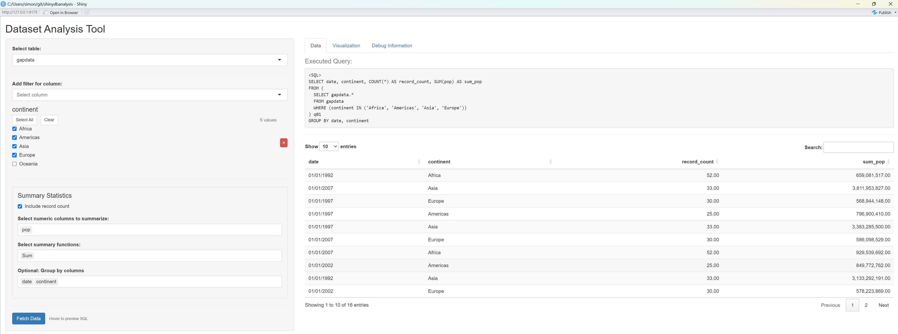
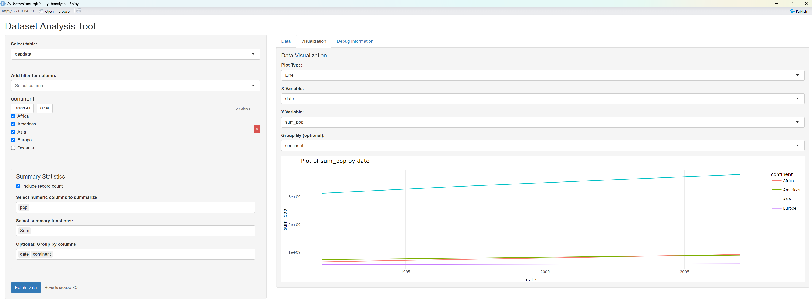
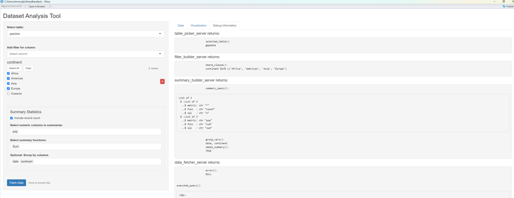

<!-- README.md is generated from README.Rmd. Please edit that file -->

# shinydbanalysis

A database-agnostic Shiny package for interactive data analysis with
filtering, grouping, and summarization capabilities. Works with any
database supported by dbplyr.

The goal is to allow the user to easily interact with tables that are
lazy-loaded in a SQL database.  
Lazy loading is great as it saves on RAM and all the computations happen
on the SQL server.  
I wanted the user to be able to easily pick filters like in the
{shinyDataFilter} package, which sadly doesnt support databases at the
moment.  
I found that querying the databases “on the fly” to get the column names
or the distinct values of each columns takes a while and makes my apps
unenjoyable to use. The idea I came up with is to get ALL the distinct
values in a script in a script that lives in a cronjob, then have the
shiny app simply load these distinct values (and column data types) at
startup.

The {shinydbanalysis} offer the following modules you can use in your
own apps:

- table_picker_server() , allows the user to pick the table they want to
  use. The table must exist in the pool and also have had
  `create_column_info("tablename", pool, "column_info")` run to create
  it’s metadata file.  
- filter_builder_server() allows the user to create the filters they
  want.  
- summary_builder_server() allows the user to select the summary
  functions they want to use (count, max, min ,mean) and on which
  (numeric) variables they want to apply them  
- data_fetcher_server() creates a sql query from all of the above and
  returns the fetched table.  
- plot_builder_server() allows the user to create a plot from the
  fetched data.

## Installation

``` r
# install.packages("devtools")
devtools::install_github("SimonCoulombe/shinydbanalysis")
```

## Quick Start: Built-in App “run_app” with Example Data

``` r

library(shinydbanalysis)
library(duckdb) # for local database example
library(pool)
library(ggplot2)  # for the diamonds dataset
library(gapminder) # for gapminder dataset 
library(arrow) # we save as parquet files  
library(dplyr) 
library(AzureStor) # we can save column info to ADLS directly instead of local hardrive for deployment on servers

gapdata <- gapminder::gapminder %>%  mutate(date = as.Date(paste0(year, "-01-01"))) %>% filter(year >= 1990) %>% mutate(prout = NA_character_)
# Create a DuckDB connection pool (in-memory database)
pool <- dbPool(
  drv = duckdb::duckdb(),
  dbdir = ":memory:"
)

# Load some example datasets
dbWriteTable(pool, SQL("diamonds"), ggplot2::diamonds)    # using the SQL() functions helps when trying to write a table to a schema, and doesnt hurt otherwise.
dbWriteTable(pool, SQL("iris"), iris)
dbWriteTable(pool, SQL("gapdata"), gapdata)


# Generate column information for each table
create_column_info("diamonds", pool)
create_column_info("iris", pool)
create_column_info("gapdata", pool)


# Launch the app-
# Local storage
run_app(
  pool = pool,
  storage_type = "local",
  local_dir = "column_info"
)

# ADLS storage
#run_app(
#   pool = pool,
#   storage_type = "adls",
#   adls_endpoint = "https://myaccount.dfs.core.windows.net",
#   adls_container = "mycontainer",
#   sas_token = "mysastoken"
# )
```

Screenshot of the app after fetching some data:  


Screenshot of the app after fetching some data and creating a data
vizualisation:  


Screenshot of the app in the “debug information” tab:

<figure>

<figcaption aria-hidden="true">Dataset Analysis Tool</figcaption>
</figure>

Below is the example of the content of the column_info parquet files :

``` r
library(shinydbanalysis)
metadata_df <- read_column_info(
    tablename = "gapdata",
    storage_type = "local",
    local_dir = "column_info"
  )
#> The tzdb package is not installed. Timezones will not be available to Arrow compute functions.
metadata_df
#> $metadata
#> # A tibble: 8 × 8
#>   column_name column_type min_value   max_value min_date   max_date   n_distinct
#>   <chr>       <chr>           <dbl>       <dbl> <date>     <date>          <int>
#> 1 year        numeric        1992        2.01e3 NA         NA                  4
#> 2 lifeExp     numeric          23.6      8.26e1 NA         NA                560
#> 3 pop         numeric      125911        1.32e9 NA         NA                568
#> 4 gdpPercap   numeric         241.       4.94e4 NA         NA                568
#> 5 date        date             NA       NA      1992-01-01 2007-01-01          4
#> 6 country     categorical      NA       NA      NA         NA                142
#> 7 continent   categorical      NA       NA      NA         NA                  5
#> 8 prout       categorical      NA       NA      NA         NA                  0
#> # ℹ 1 more variable: created_at <dttm>
#> 
#> $distinct_values
#> # A tibble: 147 × 2
#>    column_name value      
#>    <chr>       <chr>      
#>  1 country     Afghanistan
#>  2 country     Albania    
#>  3 country     Algeria    
#>  4 country     Angola     
#>  5 country     Argentina  
#>  6 country     Australia  
#>  7 country     Austria    
#>  8 country     Bahrain    
#>  9 country     Bangladesh 
#> 10 country     Belgium    
#> # ℹ 137 more rows
```

## Building a Custom App (Diamond Analysis)

For more control, you can build your own Shiny app using the package’s
components. Here we build a custom app that will plot the diamond data
when it isnt grouped.

``` r

library(shinydbanalysis)
library(duckdb)
library(pool)
library(ggplot2)
library(dplyr)

# Create a DuckDB connection pool (in-memory database)
pool <- dbPool(
  drv = duckdb::duckdb(),
  dbdir = ":memory:"
)

# Set up data
dir.create("column_info", showWarnings = FALSE)
dbWriteTable(pool, "diamonds", ggplot2::diamonds)

# Create column info with new format
create_column_info(
  tablename = "diamonds",
  pool = pool,
  storage_type = "local",
  local_dir = "column_info"
)

# Create storage info configuration
storage_info <- list(
  storage_type = "local",
  local_dir = "column_info",
  adls_endpoint = NULL,
  adls_container = NULL,
  sas_token = NULL
)

# Create a Shiny app
ui <- fluidPage(
  titlePanel("Diamond Analysis"),
  
  sidebarLayout(
    sidebarPanel(
      table_picker_ui("table"),
      hr(),
      filter_builder_ui("filters"),
      hr(),
      summary_builder_ui("summaries"),
      hr(),
      data_fetcher_ui("fetcher", style = "hover")
    ),
    
    mainPanel(
      plotOutput("scatter_plot"),
      tableOutput("results_table")
    )
  )
)

server <- function(input, output, session) {
  # Initialize modules with new storage configuration
  table_info <- table_picker_server("table", pool, storage_info)
  
  # Get current column info reactively
  current_column_info <- reactive({
    req(table_info$selected_table())
    read_column_info(
      tablename = table_info$selected_table(),
      storage_type = storage_info$storage_type,
      local_dir = storage_info$local_dir
    )
  })
  
  filter_results <- filter_builder_server(
    "filters",
    storage_info = storage_info,
    selected_table = table_info$selected_table
  )
  
  summary_results <- summary_builder_server(
    "summaries",
    selected_table = table_info$selected_table,
    column_info = current_column_info
  )
  
  # Initialize data fetcher
  fetched_data <- data_fetcher_server(
    "fetcher",
    pool = pool,
    table_info = table_info,
    filter_builder = filter_results,
    summary_builder = summary_results
  )
  
  # Scatter plot of price vs carat
  output$scatter_plot <- renderPlot({
    req(fetched_data$data())
    data <- fetched_data$data()
    
    if ("price" %in% names(data) && "carat" %in% names(data)) {
      ggplot(data, aes(x = carat, y = price)) +
        geom_point(aes(color = cut), alpha = 0.6) +
        geom_smooth(method = "lm", color = "red", se = FALSE) +
        theme_minimal() +
        labs(
          title = "Diamond Price vs Carat",
          x = "Carat",
          y = "Price ($)",
          color = "Cut"
        )
    }
  })
  
  # Results table
  output$results_table <- renderTable({
    req(fetched_data$data())
    head(fetched_data$data(), 10)
  })
}

# Run the application
shinyApp(ui = ui, server = server)
```

<figure>

<figcaption aria-hidden="true">Diamond Analysis</figcaption>
</figure>

## Using Different Databases

The package works with any database supported by dbplyr. Here are some
connection examples:

### SQLite

**WARNING: SQLITE DOESNT PLAY NICE WITH DATES**

``` r
library(RSQLite)

# Create database connection pool
pool <- dbPool(
  drv = SQLite(),
  dbname = "my_database.sqlite"
)

# Load example dataset
dbWriteTable(pool, "mtcars", mtcars, overwrite = TRUE)

# Create directory for metadata
dir.create("column_info", showWarnings = FALSE)

# Generate column information with new format
create_column_info(
  tablename = "mtcars",
  pool = pool,
  storage_type = "local",
  local_dir = "column_info"
)

# Launch the app with explicit storage configuration
run_app(
  pool = pool,
  storage_type = "local",
  local_dir = "column_info"
)
```

## Debug Panel in the default app

The debug panel shows: - Currently selected table - Active filters and
their conditions - Grouping variables - Requested summary calculations -
The actual SQL query being executed

This information is invaluable for understanding how your selections are
being translated into database operations.

## Contributing

Please feel free to submit issues and pull requests!

## License

This project is licensed under the MIT License.
